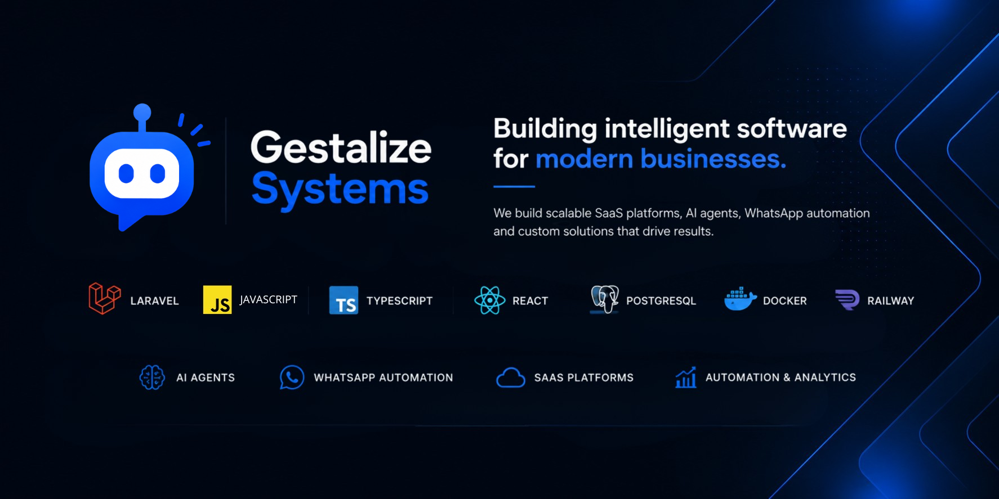

  

<h1>I'm Nathasha Lopes</h1>

<h3>Front-end Developer | Founder @ Gestalize Systems</h3>

Building software that automates businesses through modern web technologies and AI.

 

  
  
  
  

## Featured Projects

<table align="center">
<tr>

<td width="33%" align="center" valign="top">

<h3>
<a href="https://github.com/gestalizesystems/gestalize-finance">
Gestalize Finance
</a>
</h3>

A financial management platform focused on automation, performance and scalability.
 
</td>

<td width="33%" align="center" valign="top">

<h3>
<a href="https://github.com/gestalizesystems/videira-clinic">
Gestalize Care
</a>
</h3>

A SaaS platform for healthcare professionals to reserve consultation rooms and manage bookings efficiently.
 
</td>

<td width="33%" align="center" valign="top">

<h3>
<a href="https://github.com/gestalizesystems/lecoland-bot">
Gestalize Bots
</a>
</h3>

An AI-powered WhatsApp assistant that automates conversations, customer support and lead generation.
 
</td>

</tr>
</table>

  
  
  

              
